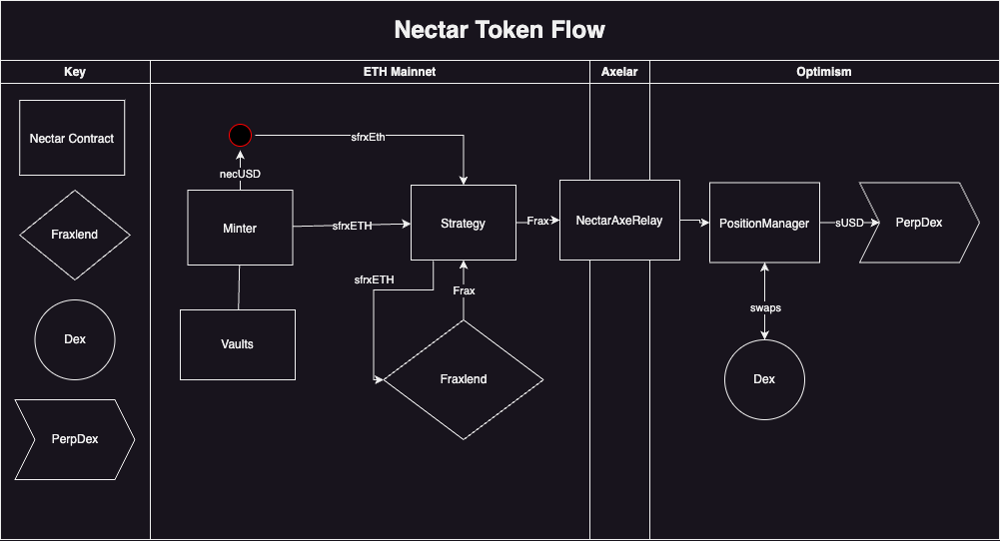

# Nectar-Hedge-Axelar

## Overview

Nectar-Hedge-Axelar is a precursor to Hedge's Minimum Viable Product (MVP), designed to leverage Axelar for cross-chain execution. This project is configured to be integrated with various perp dexs into the Hedge platform. 

## Dev Dependencies

The project utilizes the following packages:
- [Fraxlend](https://github.com/FraxFinance/fraxlend)
- [Axelar GMP sdk](https://github.com/axelarnetwork/axelar-gmp-sdk-solidity)

## Getting Started

To get started, follow these steps:

1. Clone this repo
2. Install Node.js if you haven't already.
5. Run npm install to install dependencies

## Project Details

LSD Integration: Currently configured for sfrxEth and Frax, for use with Fraxlend. In the next iteration, we could move token specific variables into a data struct that will allow us to easily integrate alt LSDs into the Hedge product 

Perp DEX Integration: This repo can serve as a foundation for integrate with any perp dex. The intention is to expand this project to include Synthetix (Optimism), GMXv2 (Arbitrum), and other platforms interest.

Order Execution Logic: For each perp dex integration, the order execution logic will need to be implemented differently, tailored to the specific platform. We'll need to create interfaces for each platform that can receive the same arguments through our Axelar configuration. Should only need totalEthCollateral on lending platform, and call to either add or remove collateral from perp dex.

Future: The long-term vision includes the possibility of swapping out Fraxlend components with AAVE, allowing the integration of alternate yield-bearing tokens such as StETH and rETH as collateral. We can acheive this by moving our Hedge state variables into data structures that allows us to incorporate multiple configurations

## Hedge Flow Chart




# Hedgenomics

## Principle

Hedge automates the process of delta hedging by establishing a delta neutral position for a given collateral token on the user’s behalf. For example, if a user wishes to forgo the volatility risk inherent with an asset like sfrxEth, but still receive the yield inherent with maintaining their sfrxEth position, Hedge allows the user’s asset value to stay flat, while their yield-bearing tokens earn yield.

Delta neutral means neutral to change. With regard to our use case, it means maintaining two equal and opposite positions to neutralize any price change in the underlying asset.

## How it Works

The protocol utilizes a decentralized lending service such as Fraxlend or Aave to establish the “long” position, and a perpetuals dex such as Kwenta, or GMX to establish a short position of equal value. Users’ deposits and the total value locked are measured in dollars and stay flat, via the rebalancing of the hedged position.

## User Level Accounting

When a user deposits sfrxEth, they are issued a number of shares equal to the dollar value of their deposit at the time. For example, if a user deposits one sfrxEth and the price of sfrxEth at the time of deposit is $2000, the user will receive 2000 shares. The value of their shares will remain the same regardless of changes to the price of sfrxEth. When the user closes their position by making a withdrawal, they will receive a quantity of sfrxEth equal to $2000 worth of sfrxEth at the time of withdrawal. If sfrxEth is worth $1900, the user will receive ~1.0526 sfrxEth from Hedge.

## Contract Level Accounting

The Hedge smart contracts maintain the flat value of the protocol's liquidity by adjusting exposure in either direction whenever a user makes a deposit or withdrawal. The TVL is measured in dollars, but the assets in Hedge's custody are sfrxEth and an Eth short of equivalent value.

## Balancing the Hedge

Like any good bush, our Hedge requires maintenance to stay in good shape. The system is designed to preserve the stability of its own delta-neutral position in as few moves as possible.

...

## Glossary

- **TVL** - Total Value Locked
- **Collateral Balance** - Hedge’s total amount of sfrxEth held in Fraxlend as deposit collateral.
- **Total Collateral Value (TCV)** - Dollar value of Hedge’s collateral holdings on Fraxlend.
- **Position Size** - The value of the short position on the perp dex.
- **Total Borrowed** - The total amount borrowed by Hedge from Fraxlend at any given time.
- **LTV (Loan to Value)** - Ratio of the value of Frax borrowed by Hedge and the value of its Collateral Balance.
- **Solvency** - Protocols solvency with regard to sfrxEth collateral available to cover the combined total of users’ positions.
- **Desired LTV** - A benchmark ratio used to preserve a balanced state.

...

# Hedge Smart Contract Technical Documentation

## Overview

Hedge is a smart contract developed by Nectar Development Co., implementing a one-click delta-neutral strategy. The primary purpose of Hedge is to manage a delta-neutral position using collateralized assets and borrowed assets through the Fraxlend protocol. This documentation provides a technical overview of the contract's structure, state variables, events, modifiers, and functions.

### Contract Information

- **Name:** Hedge
- **License:** MIT
- **Solidity Version:** >=0.8.20
- **Dependencies:**
  - OpenZeppelin Contracts v4.3.0 (IERC20, IERC20Metadata, ReentrancyGuard, SafeERC20, SafeCast, Strings)

### Contact Information

For inquiries about the Hedge smart contract, you can reach out to Nectar Development Co.

## State Variables

### User-Level Accounting

```solidity
struct UserData {
    uint256 sfrxEthAmount;   // Total sfrxEth deposited by the user
    uint256 depositShares;   // Value of the user's hedge position
}

mapping(address => UserData) public userData; 
```

### Contract-Level Accounting

```solidity
uint256 public collateralBalance;     // Hedge's collateral balance on Fraxlend
uint256 public totalValueLocked;      // Hedge's total value locked
uint256 public totalBorrowed;         // Hedge's total borrowed amount
uint256 public hedgeLtv;              // Hedge's loan-to-value ratio
uint256 public collateralValue;       // Value of Hedge's collateral balance converted to dollars
uint256 public targetBorrowAmount;    // Target borrow amount for balancing Hedge
address public immutable hedge;       // Hedge's address
address public immutable positionManager;  // Nectar Position Manager address
address public immutable balancerAddress;  // Balancer / Chron Job address
IFraxlendPair public fraxlend;        // Fraxlend interface
IAxelarRelay public axelarRelay;      // Position Manager Interface
IERC20 public sfrxEth;                // sfrxETH token interface
IERC20 public frax;                   // Frax token interface
address public sfrxEthToken;          // Address of the deposit token
address public fraxToken;             // Address of the borrowed token
address public fraxlendPair;          // Address of Fraxlend Pair
address public axelarRelayAddress;    // Address of Nectar cross-chain collateral manager
string public destinationChain;       // Destination chain for Axelar
string public destinationAddress;     // Position Manager address to string for Axelar Gateway
string public symbol;                 // Loan token symbol
```

## Events

### Deposit

Emitted when a user deposits sfrxEth into the Hedge smart contract.

```solidity
event Deposit(address indexed user, uint256 sfrxEthAmount, uint256 depositShares, uint256 collateralBalance, uint256 totalValueLocked);
```

### Withdrawal

Emitted when a user withdraws sfrxEth from the Hedge smart contract.

```solidity
event Withdrawal(address indexed user, uint256 sfrxEthAmount, uint256 depositShares, uint256 collateralBalance, totalValueLocked);
```

### AssetRepayed

Emitted when Frax is repayed to Hedge's debt balance on Fraxlend.

```solidity
event AssetRepayed(uint256 totalBorrowed);
```

### HedgeBalanced

Emitted when Hedge's position is balanced.

```solidity
event HedgeBalanced(uint256 totalBorrowed);
```

## Modifiers

### onlyAxelarRelay

Ensures that the caller is the Axelar Relay contract.

```solidity
modifier onlyAxelarRelay {
    require(msg.sender == axelarRelayAddress, "Axelar Relay contract only");
    _;
}
```

### onlyBalancer

Ensures that the caller is Balancer bot

```solidity
modifier onlyBalancer {
    require(msg.sender == balancerAddress, "Balancer contract only");
    _;
}
```

## Constructor

The constructor initializes the Hedge smart contract with the provided parameters, setting various addresses and initializing state variables.

```solidity
constructor(
    address _fraxlendPair,
    address _fraxToken,
    address _sfrxEthToken,
    address _axelarRelayAddress,
    address _positionManager,
    address _balancerAddress,
    string memory _destinationChain
)
```

## Public Functions

### deposit

Allows users to deposit sfrxEth into the Hedge smart contract, updating their positions and triggering the internal _balanceHedge function.

```solidity
function deposit(uint256 _amount) external nonReentrant
```
### withdraw

Allows users to withdraw sfrxEth from the Hedge smart contract, updating their positions and triggering the internal _balanceHedge function.

```solidity
function withdraw(uint256 _amount) external nonReentrant
```
## Internal Functions

### _balanceHedge

Internal function used to maintain the delta-neutral position of the Hedge by adjusting collateral and short positions based on the loan-to-value ratio.

```solidity
function _balanceHedge() public onlyBalancer
```
### _deposit

Internal function that handles the logic for user deposits, updating user data, collateral, total value locked, and triggering the internal _balanceHedge function.

### _repayAsset

Internal function used to repay assets to Fraxlend from Hedge, updating the total borrowed amount.

```solidity
function _repayAsset(uint256 _amount) external onlyAxelarRelay

```
### _addCollateral

Internal function used to add collateral to the Hedge's Fraxlend account, updating the collateral balance.

```solidity
function _addCollateral(uint256 _amount) external onlyAxelarRelay
```
## Read-Only Functions

### getCollateralValue

Returns the dollar value of Hedge's collateral balance in Fraxlend.

```solidity
function getCollateralValue() public view returns (uint256)
```
### getSfrxEthBalance

Returns the available sfrxEth balance for a given user account.

```solidity
function getSfrxEthBalance(address _account) public view returns (uint256)
```

## Conclusion 

The Hedge smart contract implements a delta-neutral strategy, managing collateralized and borrowed assets through the Fraxlend protocol. Users can deposit and withdraw sfrxEth, while the contract internally balances its position through the _balanceHedge function. The contract interacts with the Axelar Relay and Fraxlend protocols for cross-chain functionality and lending operations, respectively. Developers and users interested in interacting with the Hedge smart contract should refer to this documentation for a comprehensive understanding of its structure and functionality.


